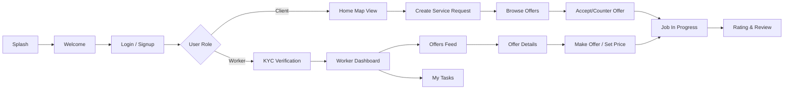
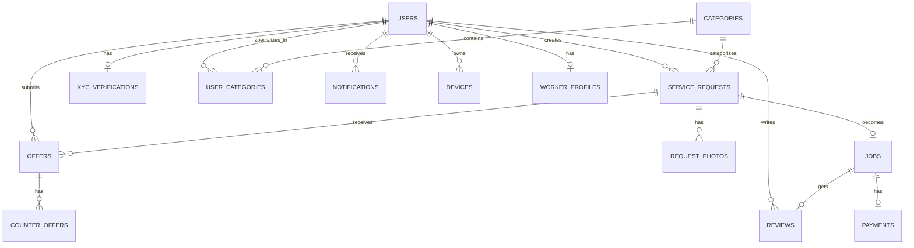
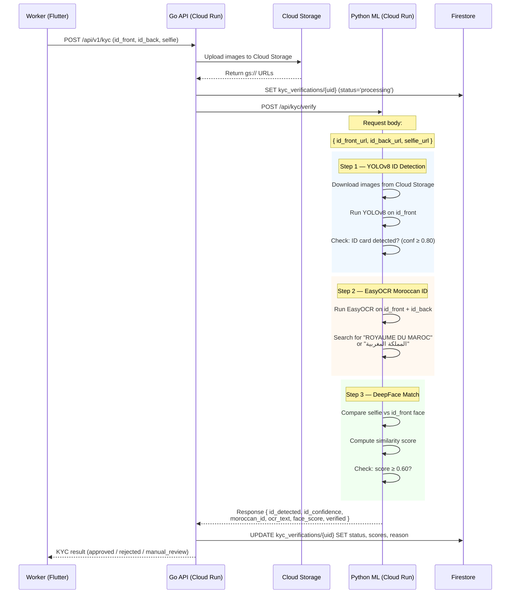

# FIXWAY — Database & Project Structure
## Flutter Frontend + Go Backend + Firebase

> **Generated from:** Stitch Project `FIXWAY` (ID: `8205867003328742382`)
> **Date:** 2026-05-09

---

## 1. Project Overview

**Fixway** is a premium **home services marketplace** mobile app connecting **clients** who need home repairs/maintenance with **verified professionals (workers)**. The design follows a "Quiet Luxury" glassmorphism aesthetic with Deep Royal Blue (#0047AB) branding.

### Core User Flows (from Stitch Screens)



---

## 2. Tech Stack

| Layer | Technology |
|---|---|
| **Frontend** | Flutter (Android, iOS, Web) |
| **Backend API** | Go (Golang) — REST API on Cloud Run |
| **API Hosting** | Google Cloud Run (containerized Go) |
| **Database** | Firebase Firestore (NoSQL document DB) |
| **File Storage** | Firebase Cloud Storage (photos, KYC docs) |
| **Auth** | Firebase Authentication (Phone, Email, Google) |
| **Real-time** | Firestore real-time listeners |
| **Background Jobs** | Google Cloud Tasks / Pub/Sub (notifications, KYC) |
| **Cache** | Firestore TTL documents (sessions, OTP codes) |
| **Push Notifications** | Firebase Cloud Messaging (FCM) |
| **AI Microservice** | Python (FastAPI) on Cloud Run — YOLOv8, EasyOCR, DeepFace |

---

## 3. All Screens Extracted from Stitch

### 3.1 Onboarding (2 screens)
| Screen | Description |
|---|---|
| **Splash Screen** | Logo animation on launch |
| **Welcome - Logo Centered** | CTA buttons: Login / Sign Up |

### 3.2 Authentication (9 screens)
| Screen | Description |
|---|---|
| **Login** | Phone/email + password |
| **Signup - Phone Number** | Phone input with country code |
| **Signup - Name** | First name, last name |
| **Signup - Password** | Password + confirm |
| **Signup - OTP Verification** | 6-digit OTP code |
| **OTP Verification** | Generic OTP screen |
| **Phone Number Verification** | Phone verify step |
| **Forgot Password - Phone** | Enter phone to reset |
| **Forgot Password - OTP** | OTP for password reset |
| **Forgot Password - New Password** | Set new password |

### 3.3 KYC — Worker Verification (8 screens)
| Screen | Description |
|---|---|
| **KYC - Intro & Consent** | Explain verification, get consent |
| **KYC - Phone Number** | Verify worker phone |
| **KYC - Select Category** | Pick service specialties |
| **KYC - ID Back Capture** | Upload ID card (back) |
| **KYC - Face Liveness (Clean)** | Live selfie check |
| **3D Face Liveness** | Advanced face verification |
| **KYC - Review Summary** | Review all KYC data before submit |
| **KYC - Processing Status** | Pending/Approved/Rejected status |

### 3.4 Home & Discovery (2 screens)
| Screen | Description |
|---|---|
| **Home - Map View** | Map with nearby workers, search bar, categories |
| **Home - Enhanced Logo View** | Alternate home with branding |

### 3.5 Service Request Flow — Client (6 screens)
| Screen | Description |
|---|---|
| **Select Category** | Pick service type (Plumbing, Electrical, etc.) |
| **Describe Problem** | Text description of the issue |
| **Add Photos** | Upload problem photos |
| **Service Location** | Pick address on map |
| **Your Budget** | Set price range |
| **Review Request** | Confirm all details before posting |

### 3.6 Offers & Negotiation (3 screens)
| Screen | Description |
|---|---|
| **My Requests** | List of client's active requests with status tabs |
| **Service Offers** | List of worker bids on a request |
| **Make Counter Offer** | Client counter-proposes a price |

### 3.7 Job & Completion (2 screens)
| Screen | Description |
|---|---|
| **Request Details** | Full job detail view |
| **Rating & Review** | Star rating + text review after job |

### 3.8 Profile & Settings (7 screens)
| Screen | Description |
|---|---|
| **Profile** | User info, stats, settings menu |
| **Language Selection** | Switch app language (Arabic, French, English) |
| **About** | App version, company info |
| **Help Center** | FAQ accordion |
| **Contact Us** | Support form |
| **Privacy Policy** | Legal text |
| **Intro & Consent** | Terms acceptance |

### 3.10 Worker — Offers & Tasks (3 screens)
| Screen | Description |
|---|---|
| **Offers List (Worker Feed)** | Incoming client offers with status badges (New / In Progress / Pending). Each card: service photo with time overlay, title, location, date/time, client budget (EGP). Safety banner. Bottom nav: Offers, My Tasks, Profile. |
| **Offer Details (Worker View)** | Full offer detail: photo gallery, Offer ID (#4587), status badge, service title, client budget, location (map link), date, time, service type. "About this offer" description. "Make offer" CTA → "Give your price" input (EGP). Quick-reply Arabic suggestion chips. 100% Safe badge. Send button. |
| **Worker Home — My Tasks** | Dashboard: greeting, profession badge (e.g. Barber — Haircut & grooming), hero image. My Tasks summary counters (Pending/Accepted/Cancelled). Three collapsible sections with task cards by status. Each card: thumbnail, title, location, date/time, price, status badge. Bottom nav. |

### 3.11 Additional Assets
| Screen | Description |
|---|---|
| **FIXWAY Service Booking App** | General booking flow |
| **fixway_noback.png** | Logo asset (transparent) |
| **Reference images** | WhatsApp screenshots of worker UI |

---

## 4. Database Schema (Firebase Firestore)

### 4.1 Entity Relationship Diagram



### 4.2 Firestore Collection Definitions

#### Collection: `users` → Document ID: `{uid}` (Firebase Auth UID)
```js
// Firestore path: users/{uid}
{
  phone: "+212612345678",
  phoneVerified: true,
  email: "user@example.com",
  firstName: "Ahmed",
  lastName: "Benali",
  avatarUrl: "gs://fixway-app.appspot.com/avatars/{uid}/profile.jpg",
  role: "client" | "worker" | "admin",
  isActive: true,
  language: "fr" | "ar" | "en",
  location: new GeoPoint(33.5731, -7.5898),
  address: "123 Rue Example",
  city: "Casablanca",
  bio: "Professional plumber...",
  ratingAvg: 4.8,
  ratingCount: 42,
  jobsCompleted: 38,
  categoryIds: ["cat_plumbing", "cat_electrical"],  // worker specialties
  createdAt: Timestamp,
  updatedAt: Timestamp
}
// Composite indexes: (role, city), (role, isActive)
```

#### Collection: `categories` → Document ID: `{category_id}`
```js
// Firestore path: categories/{category_id}
{
  nameEn: "Plumbing",
  nameFr: "Plomberie",
  nameAr: "السباكة",
  iconUrl: "gs://fixway-app.appspot.com/categories/cat_plumbing/icon.png",
  isActive: true,
  sortOrder: 1,
  createdAt: Timestamp
}
```

#### Collection: `kyc_verifications` → Document ID: `{uid}` (same as user)
```js
// Firestore path: kyc_verifications/{uid}
{
  userId: "uid_string",
  status: "pending" | "processing" | "approved" | "rejected" | "expired",
  idFrontUrl: "gs://fixway-app.appspot.com/kyc/{uid}/id_front.jpg",
  idBackUrl: "gs://fixway-app.appspot.com/kyc/{uid}/id_back.jpg",
  selfieUrl: "gs://fixway-app.appspot.com/kyc/{uid}/selfie.jpg",
  idType: "national_id" | "passport" | "driver_license",
  idNumber: "AB123456",
  fullName: "أحمد بنعلي",
  dateOfBirth: "1995-03-15",
  // AI Analysis Results
  aiIdDetected: true,           // YOLO: ID card present
  aiIdConfidence: 0.95,         // YOLO: confidence (0.0–1.0)
  aiMoroccanId: true,           // EasyOCR: "ROYAUME DU MAROC" or "المملكة المغربية"
  aiOcrExtracted: { ... },      // EasyOCR: all extracted text fields (map)
  faceMatchScore: 0.87,         // DeepFace: similarity (0.0–1.0)
  faceMatchVerified: true,      // DeepFace: score ≥ threshold
  aiProcessedAt: Timestamp,
  rejectionReason: "",
  reviewedBy: null,             // null if auto-approved by AI
  submittedAt: Timestamp,
  reviewedAt: Timestamp,
  expiresAt: Timestamp
}
// Index: (status)
```

#### Collection: `service_requests` → Document ID: auto-generated
```js
// Firestore path: service_requests/{request_id}
{
  clientId: "uid_string",
  categoryId: "cat_plumbing",
  title: "Fix kitchen sink",
  description: "Leaking pipe under the kitchen sink...",
  location: new GeoPoint(33.5731, -7.5898),
  address: "123 Rue Example, Casablanca",
  city: "Casablanca",
  budgetMin: 200,
  budgetMax: 500,
  urgency: "normal" | "urgent" | "flexible",
  status: "open" | "in_offers" | "accepted" | "in_progress" | "completed" | "cancelled",
  preferredDate: Timestamp,
  preferredTime: "10:00",
  offerCount: 3,
  photoUrls: [                  // Embedded array instead of separate collection
    "gs://fixway-app.appspot.com/requests/{request_id}/photo_1.jpg",
    "gs://fixway-app.appspot.com/requests/{request_id}/photo_2.jpg"
  ],
  createdAt: Timestamp,
  updatedAt: Timestamp,
  expiresAt: Timestamp
}
// Composite indexes: (clientId, status), (categoryId, status), (city, status, createdAt)
```

#### Collection: `offers` → Document ID: auto-generated
```js
// Firestore path: offers/{offer_id}
{
  offerNumber: 4587,            // Sequential display ID
  requestId: "request_id_string",
  workerId: "uid_string",
  price: 350.0,
  message: "I can fix this quickly...",
  quickMessages: ["msg_id_1", "msg_id_2"],  // Selected quick-reply chip IDs
  estimatedHours: 2.0,
  status: "pending" | "accepted" | "rejected" | "withdrawn" | "countered",
  viewedAt: Timestamp,
  respondedAt: Timestamp,
  createdAt: Timestamp,
  updatedAt: Timestamp
}
// Composite indexes: (requestId, status), (workerId, status), (workerId, createdAt)
```

#### Subcollection: `offers/{offer_id}/counter_offers` → Document ID: auto-generated
```js
// Firestore path: offers/{offer_id}/counter_offers/{counter_id}
{
  fromUser: "uid_string",       // client or worker
  price: 300.0,
  message: "Can you do it for less?",
  status: "pending" | "accepted" | "rejected",
  createdAt: Timestamp
}
```

#### Collection: `jobs` → Document ID: auto-generated
```js
// Firestore path: jobs/{job_id}
{
  requestId: "request_id_string",
  offerId: "offer_id_string",
  clientId: "uid_string",
  workerId: "uid_string",
  agreedPrice: 350.0,
  status: "scheduled" | "in_progress" | "completed" | "disputed" | "cancelled",
  startedAt: Timestamp,
  completedAt: Timestamp,
  cancelledAt: Timestamp,
  cancelReason: "",
  cancelledBy: "client" | "worker" | "admin",
  createdAt: Timestamp,
  updatedAt: Timestamp
}
// Composite indexes: (clientId, status), (workerId, status)
```

#### Collection: `payments` → Document ID: auto-generated
```js
// Firestore path: payments/{payment_id}
{
  jobId: "job_id_string",
  payerId: "uid_string",
  amount: 350.0,
  platformFee: 35.0,
  workerPayout: 315.0,
  method: "cash" | "card" | "wallet",
  status: "pending" | "completed" | "refunded" | "failed",
  transactionRef: "txn_abc123",
  paidAt: Timestamp,
  createdAt: Timestamp
}
// Index: (jobId)
```

#### Collection: `reviews` → Document ID: `{job_id}` (one review per job)
```js
// Firestore path: reviews/{job_id}
{
  jobId: "job_id_string",
  reviewerId: "uid_string",     // client
  revieweeId: "uid_string",     // worker
  rating: 5,                    // 1–5
  comment: "Great work!",
  createdAt: Timestamp
}
// Index: (revieweeId, createdAt)
```

#### Collection: `notifications` → Document ID: auto-generated
```js
// Firestore path: notifications/{notif_id}
{
  userId: "uid_string",
  type: "new_offer" | "offer_accepted" | "job_started" | "job_completed" | "review" | "kyc_status" | "counter_offer",
  title: "New offer received",
  body: "A worker submitted an offer for your request",
  data: { requestId: "...", offerId: "..." },  // Deep linking payload
  isRead: false,
  createdAt: Timestamp
}
// Composite index: (userId, isRead, createdAt)
```

#### Collection: `devices` → Document ID: auto-generated
```js
// Firestore path: devices/{device_id}
{
  userId: "uid_string",
  fcmToken: "fcm_token_string",
  platform: "android" | "ios" | "web",
  isActive: true,
  createdAt: Timestamp,
  updatedAt: Timestamp
}
// Index: (userId, isActive)
```

#### Collection: `worker_profiles` → Document ID: `{uid}` (same as user)
```js
// Firestore path: worker_profiles/{uid}
{
  userId: "uid_string",
  profession: "Barber",
  tagline: "Haircut & grooming",
  heroImageUrl: "gs://fixway-app.appspot.com/workers/{uid}/hero.jpg",
  isAvailable: true,
  pendingCount: 3,
  acceptedCount: 2,
  cancelledCount: 1,
  createdAt: Timestamp,
  updatedAt: Timestamp
}
```

#### Collection: `offer_quick_messages` → Document ID: auto-generated
```js
// Firestore path: offer_quick_messages/{msg_id}
{
  textAr: "عندي تجربة مزيانة فهذ المجال والخدمة",
  textFr: "J'ai une bonne expérience dans ce domaine",
  textEn: "I have great experience in this field",
  icon: "👍",
  sortOrder: 1,
  isActive: true,
  createdAt: Timestamp
}
```

#### Collection: `otp_codes` → Document ID: `{phone_number}` (with Firestore TTL)
```js
// Firestore path: otp_codes/{phone_number}
// TTL policy: auto-delete when expiresAt is reached
{
  code: "123456",
  attempts: 0,
  purpose: "signup" | "reset",
  createdAt: Timestamp,
  expiresAt: Timestamp          // Firestore TTL field — auto-deletes after 5 min
}
```

---

## 5. Firebase + Cloud Run Architecture

```
┌─────────────────────────────────────────────────┐
│                 Flutter App                      │
│          (Android / iOS / Web)                   │
│  ┌──────────────┐  ┌─────────────────────────┐  │
│  │ Firebase SDK │  │ Firebase Auth SDK       │  │
│  │ (Firestore,  │  │ (Phone, Email, Google)  │  │
│  │  Storage)    │  │                         │  │
│  └──────┬───────┘  └───────────┬─────────────┘  │
└─────────┼─────────────────────┼──────────────────┘
          │                     │
          │ HTTPS               │ Auth Token
          ▼                     ▼
┌─────────────────────────────────────────────────┐
│        Go API on Google Cloud Run               │
│  ┌───────────┐ ┌──────────┐ ┌──────────────┐   │
│  │ Auth MW   │ │ Core API │ │ KYC Handler  │   │
│  │ Firebase  │ │ /api/v1/*│ │ (async)      │   │
│  │ Token     │ │          │ │              │   │
│  └───────────┘ └──────────┘ └──────┬───────┘   │
│  ┌────────────────────────────┐    │            │
│  │ Firebase Admin SDK (Go)   │    │            │
│  │ • Firestore client        │    │            │
│  │ • Cloud Storage client    │    │            │
│  │ • FCM push sender         │    │            │
│  └────────────────────────────┘    │            │
└──────┬──────────┬──────────┬───────┼────────────┘
       │          │          │       │
  ┌────▼──────┐ ┌─▼────────┐│  ┌────▼───────┐ HTTP POST
  │ Firestore │ │ Cloud    ││  │ Cloud      │ /api/kyc/verify
  │ Database  │ │ Storage  ││  │ Tasks /    │
  │ • users   │ │ • photos ││  │ Pub/Sub    │
  │ • offers  │ │ • KYC    ││  └────┬───────┘
  │ • jobs    │ │ • avatars││       │
  │ • OTP/TTL │ └──────────┘│       ▼
  └───────────┘             │  ┌──────────────────────────┐
                            │  │  Python ML Microservice  │
  ┌─────────────┐           │  │  (FastAPI on Cloud Run)  │
  │ Firebase    │           │  │  ┌────────┐ ┌─────────┐  │
  │ Cloud       │◄──────────┘  │  │ YOLOv8 │ │ EasyOCR │  │
  │ Messaging   │              │  │ID Det. │ │Moroccan │  │
  │ (FCM Push)  │              │  └────────┘ │ID Text  │  │
  └─────────────┘              │  ┌────────┐ └─────────┘  │
                               │  │DeepFace│              │
                               │  │Face    │              │
                               │  │Match   │              │
                               │  └────────┘              │
                               └──────────────────────────┘
```

### Cloud Storage Bucket Structure
```
fixway-app.appspot.com/
├── avatars/{user_id}/profile.jpg
├── kyc/{user_id}/id_front.jpg
├── kyc/{user_id}/id_back.jpg
├── kyc/{user_id}/selfie.jpg
├── requests/{request_id}/photo_{n}.jpg
└── categories/{category_id}/icon.png
```

---

## 6. Go API Route Map

| Method | Route | Description |
|---|---|---|
| `POST` | `/auth/signup` | Register new user |
| `POST` | `/auth/login` | Login with phone + password |
| `POST` | `/auth/otp/send` | Send OTP code |
| `POST` | `/auth/otp/verify` | Verify OTP code |
| `POST` | `/auth/password/reset` | Reset password |
| `GET` | `/api/v1/categories` | List all categories |
| `GET` | `/api/v1/users/me` | Get current user profile |
| `PUT` | `/api/v1/users/me` | Update profile |
| `PUT` | `/api/v1/users/me/language` | Change language |
| `POST` | `/api/v1/kyc` | Submit KYC documents |
| `GET` | `/api/v1/kyc/status` | Get KYC status |
| `POST` | `/api/v1/requests` | Create service request |
| `GET` | `/api/v1/requests` | List my requests (with status tabs) |
| `GET` | `/api/v1/requests/:id` | Get request details |
| `DELETE` | `/api/v1/requests/:id` | Cancel request |
| `GET` | `/api/v1/requests/:id/offers` | List offers for a request |
| `POST` | `/api/v1/offers` | Worker submits offer |
| `PUT` | `/api/v1/offers/:id/accept` | Client accepts offer |
| `PUT` | `/api/v1/offers/:id/reject` | Client rejects offer |
| `POST` | `/api/v1/offers/:id/counter` | Make counter offer |
| `GET` | `/api/v1/jobs` | List my jobs |
| `PUT` | `/api/v1/jobs/:id/start` | Mark job started |
| `PUT` | `/api/v1/jobs/:id/complete` | Mark job completed |
| `POST` | `/api/v1/jobs/:id/review` | Submit rating & review |
| `GET` | `/api/v1/notifications` | Get notifications |
| `PUT` | `/api/v1/notifications/read` | Mark as read |
| `POST` | `/api/v1/upload` | Upload photo to Cloud Storage |
| `GET` | `/api/v1/workers/nearby` | Find workers near location |
| `GET` | `/api/v1/workers/me/profile` | Get worker profile (profession, tagline, hero) |
| `PUT` | `/api/v1/workers/me/profile` | Update worker profile |
| `GET` | `/api/v1/workers/me/offers` | Worker's incoming offers feed (with status filters) |
| `GET` | `/api/v1/workers/me/offers/:id` | Get full offer details (worker view) |
| `POST` | `/api/v1/workers/me/offers/:id/respond` | Worker submits price + quick messages |
| `GET` | `/api/v1/workers/me/tasks` | Worker's tasks grouped by status |
| `GET` | `/api/v1/workers/me/tasks/summary` | Task count summary (pending/accepted/cancelled) |
| `GET` | `/api/v1/offer-quick-messages` | List quick-reply template chips |
| `GET` | `/api/v1/help` | Help center content |
| `POST` | `/api/v1/contact` | Submit contact form |

---

## 7. Full Project Structure

### 7.1 Flutter Frontend (`fixway_app/`)
```
fixway_app/
├── lib/
│   ├── main.dart                    # App entry point, MaterialApp, routing
│   ├── app.dart                     # Root widget, theme, navigation setup
│   ├── config/
│   │   ├── theme.dart               # Deep Royal Blue theme, glassmorphism tokens
│   │   ├── routes.dart              # Named routes & GoRouter config
│   │   ├── constants.dart           # API base URL, timeouts, keys
│   │   └── firebase_options.dart    # Firebase init config (auto-generated)
│   ├── core/
│   │   ├── api/
│   │   │   ├── api_client.dart      # HTTP client (Dio) + Firebase Auth token injection
│   │   │   ├── api_endpoints.dart   # All Go API endpoint constants
│   │   │   └── api_interceptor.dart # Auth header, error handling, retry
│   │   ├── models/
│   │   │   ├── user.dart            # User model (from Firestore)
│   │   │   ├── category.dart        # Category model
│   │   │   ├── service_request.dart # Service request model
│   │   │   ├── offer.dart           # Offer model
│   │   │   ├── job.dart             # Job model
│   │   │   ├── review.dart          # Review model
│   │   │   ├── notification.dart    # Notification model
│   │   │   └── kyc_verification.dart
│   │   ├── services/
│   │   │   ├── auth_service.dart    # Firebase Auth (phone, email, Google)
│   │   │   ├── storage_service.dart # Firebase Cloud Storage uploads
│   │   │   ├── push_service.dart    # FCM token registration & handling
│   │   │   └── location_service.dart # GPS / Geolocator
│   │   ├── providers/
│   │   │   ├── auth_provider.dart   # Auth state management
│   │   │   └── user_provider.dart   # Current user state
│   │   └── widgets/
│   │       ├── glassmorphism_card.dart
│   │       ├── loading_indicator.dart
│   │       ├── custom_button.dart
│   │       └── status_badge.dart
│   ├── features/
│   │   ├── onboarding/
│   │   │   ├── splash_screen.dart
│   │   │   └── welcome_screen.dart
│   │   ├── auth/
│   │   │   ├── login_screen.dart
│   │   │   ├── signup_phone_screen.dart
│   │   │   ├── signup_name_screen.dart
│   │   │   ├── signup_password_screen.dart
│   │   │   ├── otp_verification_screen.dart
│   │   │   ├── forgot_password_screen.dart
│   │   │   └── widgets/
│   │   │       ├── otp_input_field.dart
│   │   │       └── phone_input_field.dart
│   │   ├── kyc/
│   │   │   ├── kyc_intro_screen.dart
│   │   │   ├── kyc_phone_screen.dart
│   │   │   ├── kyc_category_screen.dart
│   │   │   ├── kyc_id_capture_screen.dart
│   │   │   ├── kyc_face_liveness_screen.dart
│   │   │   ├── kyc_review_screen.dart
│   │   │   ├── kyc_status_screen.dart
│   │   │   └── widgets/
│   │   │       ├── camera_overlay.dart
│   │   │       └── kyc_step_indicator.dart
│   │   ├── home/
│   │   │   ├── home_map_screen.dart
│   │   │   └── widgets/
│   │   │       ├── category_chips.dart
│   │   │       ├── worker_map_marker.dart
│   │   │       └── search_bar.dart
│   │   ├── request/                 # Client — service request flow
│   │   │   ├── select_category_screen.dart
│   │   │   ├── describe_problem_screen.dart
│   │   │   ├── add_photos_screen.dart
│   │   │   ├── set_budget_screen.dart
│   │   │   ├── request_confirmation_screen.dart
│   │   │   ├── request_detail_screen.dart
│   │   │   └── widgets/
│   │   │       ├── budget_slider.dart
│   │   │       └── photo_picker.dart
│   │   ├── offer/                   # Client — browsing & responding to offers
│   │   │   ├── offers_list_screen.dart
│   │   │   ├── offer_detail_screen.dart
│   │   │   ├── counter_offer_screen.dart
│   │   │   └── widgets/
│   │   │       ├── offer_card.dart
│   │   │       └── price_badge.dart
│   │   ├── worker/                  # Worker — dashboard, offers, tasks
│   │   │   ├── worker_dashboard_screen.dart
│   │   │   ├── worker_offers_feed_screen.dart
│   │   │   ├── worker_offer_detail_screen.dart
│   │   │   ├── worker_respond_screen.dart
│   │   │   ├── my_tasks_screen.dart         # ✅ Existing
│   │   │   └── widgets/
│   │   │       ├── task_card.dart
│   │   │       ├── quick_reply_chips.dart
│   │   │       └── status_tab_bar.dart
│   │   ├── job/
│   │   │   ├── job_in_progress_screen.dart
│   │   │   ├── job_complete_screen.dart
│   │   │   └── widgets/
│   │   │       └── job_timeline.dart
│   │   ├── review/
│   │   │   └── rating_review_screen.dart
│   │   ├── notification/
│   │   │   └── notifications_screen.dart
│   │   └── profile/
│   │       ├── profile_screen.dart
│   │       ├── edit_profile_screen.dart
│   │       ├── worker_profile_screen.dart
│   │       └── settings_screen.dart
│   └── l10n/                        # Localization
│       ├── app_ar.arb               # Arabic
│       ├── app_fr.arb               # French
│       └── app_en.arb               # English
├── assets/
│   └── images/
│       ├── worker.png               # ✅ Existing
│       ├── category.png             # ✅ Existing
│       ├── logo.png
│       └── onboarding/
├── android/
├── ios/
├── web/
├── pubspec.yaml
├── analysis_options.yaml
└── README.md
```

### 7.2 Go Backend API (`fixway-api/`)
```
fixway-api/
├── cmd/
│   └── server/
│       └── main.go              # HTTP server entry (Cloud Run)
├── internal/
│   ├── auth/
│   │   ├── handler.go           # Login, Signup, OTP, Reset
│   │   ├── firebase_auth.go     # Firebase Auth token verification
│   │   └── middleware.go        # Auth middleware (Firebase ID tokens)
│   ├── user/
│   │   ├── handler.go           # Profile CRUD
│   │   ├── model.go             # User struct
│   │   └── repository.go       # Firestore queries
│   ├── kyc/
│   │   ├── handler.go           # KYC submission
│   │   ├── model.go
│   │   ├── processor.go        # Pub/Sub consumer
│   │   └── ai_client.go        # HTTP client for Python ML microservice
│   ├── request/
│   │   ├── handler.go           # Service requests
│   │   ├── model.go
│   │   └── repository.go
│   ├── offer/
│   │   ├── handler.go           # Offers + counter offers
│   │   ├── model.go
│   │   └── repository.go
│   ├── job/
│   │   ├── handler.go           # Job lifecycle
│   │   ├── model.go
│   │   └── repository.go
│   ├── review/
│   │   ├── handler.go
│   │   └── model.go
│   ├── notification/
│   │   ├── handler.go
│   │   └── push.go              # FCM push sender
│   ├── storage/
│   │   └── cloud_storage.go     # Firebase Cloud Storage upload/download
│   └── category/
│       ├── handler.go
│       └── model.go
├── pkg/
│   ├── response/
│   │   └── json.go              # Standard API responses
│   ├── validator/
│   │   └── validate.go
│   └── firebase/
│       └── client.go            # Firebase Admin SDK init + Firestore client
├── Dockerfile                   # Cloud Run container
├── cloudbuild.yaml              # CI/CD for Cloud Build → Cloud Run
├── go.mod
└── go.sum
```

### 7.3 Python ML Microservice (`fixway-kyc-ml/`)
```
fixway-kyc-ml/
├── app/
│   ├── main.py                    # FastAPI entry point
│   ├── config.py                  # Settings (GCS credentials, thresholds)
│   ├── routers/
│   │   └── kyc.py                 # POST /api/kyc/verify endpoint
│   ├── services/
│   │   ├── id_detector.py         # YOLOv8 — ID card presence detection
│   │   ├── ocr_service.py         # EasyOCR — Moroccan ID text recognition
│   │   └── face_matcher.py        # DeepFace — selfie vs ID photo match
│   ├── models/
│   │   └── schemas.py             # Pydantic request/response models
│   └── utils/
│       └── image_utils.py         # Download from Cloud Storage URL, preprocessing
├── weights/
│   └── yolov8_id_card.pt          # Fine-tuned YOLO weights for ID cards
├── Dockerfile
├── requirements.txt
└── README.md
```

---

## 8. Key Business Rules

| Rule | Implementation |
|---|---|
| Workers must pass KYC before receiving jobs | Check `kyc_verifications.status = 'approved'` before allowing offers |
| Clients can set a budget range | `budget_min` / `budget_max` on `service_requests` |
| Counter-offer negotiation | Chain via `counter_offers` table, max 3 rounds |
| Auto-expire open requests | Cloud Scheduler triggers Go API endpoint to check `expiresAt` daily |
| Rating updates worker average | Firestore Cloud Function trigger on `reviews` collection to recalc `ratingAvg` on `users` |
| OTP expires in 5 min | Firestore `otp_codes` collection with TTL policy (auto-delete after `expiresAt`) |
| Max 3 OTP attempts | Track `attempts` field in Firestore `otp_codes` document |
| Multi-language support | `name_en`, `name_fr`, `name_ar` columns; user `language` preference |
| Worker offer response | Worker sees client budget, enters own price, selects quick-reply chips, then sends |
| Offer status badges | `New` = just posted, `In Progress` = worker engaged, `Pending` = awaiting client |
| Worker task grouping | My Tasks dashboard groups by Pending / Accepted / Cancelled with live counts |
| Worker task counts cached | `worker_profiles` counts updated on status change |
| Phone privacy | Phone numbers never exposed — all comms via in-app |
| Offer numbering | Sequential `offer_number` (#4587) for easy reference |
| Quick-reply chips | Pre-built Arabic persuasive messages workers attach to offers |

| AI KYC — auto-verification | Go API sends Cloud Storage URLs to Python ML microservice; auto-approves if all 3 checks pass |
| AI KYC — ID detection | YOLOv8 confirms an ID card is present in the uploaded image (confidence ≥ 0.80) |
| AI KYC — Moroccan ID check | EasyOCR searches for "ROYAUME DU MAROC" or "المملكة المغربية" on the ID |
| AI KYC — Face match | DeepFace compares selfie to ID photo; threshold ≥ 0.60 for match |
| AI KYC — rejection reasons | Concatenated reasons: "no_id_detected", "not_moroccan_id", "face_mismatch" |
| AI KYC — fallback | If AI confidence is borderline (0.50–0.80), flag for manual admin review |

---

## 9.1 AI-Powered KYC Verification Flow



### ML Microservice API Contract

**`POST /api/kyc/verify`**

Request:
```json
{
  "user_id": "uid-string",
  "id_front_url": "gs://fixway-app.appspot.com/kyc/{user_id}/id_front.jpg",
  "id_back_url": "gs://fixway-app.appspot.com/kyc/{user_id}/id_back.jpg",
  "selfie_url": "gs://fixway-app.appspot.com/kyc/{user_id}/selfie.jpg"
}
```

Response:
```json
{
  "verified": true,
  "checks": {
    "id_detected": true,
    "id_confidence": 0.95,
    "moroccan_id": true,
    "moroccan_id_text": "ROYAUME DU MAROC",
    "face_match": true,
    "face_match_score": 0.87
  },
  "ocr_extracted": {
    "full_name": "أحمد بنعلي",
    "id_number": "AB123456",
    "date_of_birth": "1995-03-15"
  },
  "rejection_reasons": [],
  "processing_time_ms": 3200
}
```

### Decision Logic (in Go API on Cloud Run)
```
IF id_detected AND moroccan_id AND face_match:
    → status = 'approved'
ELSE IF id_confidence BETWEEN 0.50 AND 0.80:
    → status = 'pending' (flag for manual review)
ELSE:
    → status = 'rejected'
    → rejection_reason = joined failing checks
```

---

## 9. Seed Categories (Firestore batch write)

```js
// Firestore batch write — run once via admin script or Go init
const categories = [
  { id: "cat_plumbing",   nameEn: "Plumbing",          nameFr: "Plomberie",      nameAr: "السباكة",           sortOrder: 1  },
  { id: "cat_electrical", nameEn: "Electrical",        nameFr: "Électricité",    nameAr: "الكهرباء",          sortOrder: 2  },
  { id: "cat_carpentry",  nameEn: "Carpentry",         nameFr: "Menuiserie",     nameAr: "النجارة",           sortOrder: 3  },
  { id: "cat_painting",   nameEn: "Painting",          nameFr: "Peinture",       nameAr: "الدهان",            sortOrder: 4  },
  { id: "cat_cleaning",   nameEn: "Cleaning",          nameFr: "Nettoyage",      nameAr: "التنظيف",           sortOrder: 5  },
  { id: "cat_hvac",       nameEn: "AC & Heating",      nameFr: "Climatisation",  nameAr: "التكييف والتدفئة",   sortOrder: 6  },
  { id: "cat_gardening",  nameEn: "Gardening",         nameFr: "Jardinage",      nameAr: "البستنة",           sortOrder: 7  },
  { id: "cat_locksmith",  nameEn: "Locksmith",         nameFr: "Serrurerie",     nameAr: "الأقفال",           sortOrder: 8  },
  { id: "cat_appliance",  nameEn: "Appliance Repair",  nameFr: "Réparation",     nameAr: "إصلاح الأجهزة",     sortOrder: 9  },
  { id: "cat_general",    nameEn: "General",           nameFr: "Général",        nameAr: "عام",               sortOrder: 10 }
];

// In Go: batch.Set(firestore.Doc("categories/" + cat.id), cat)
```
